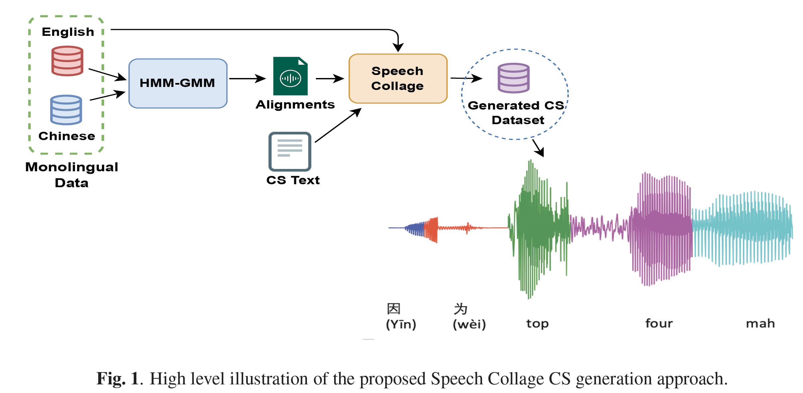

# **Speech Collage**

This repository contains the code used for the paper titled ["SPEECH COLLAGE: CODE-SWITCHED AUDIO GENERATION BY COLLAGING MONOLINGUAL CORPORA"](https://arxiv.org/pdf/2309.15674.pdf).

🔹 **Dataset Samples:** You can listen to a sample of the generated audio [here](<https://huggingface.co/datasets/AmirHussein/SpeechCollage>).

---

## **High-Level Approach Description**



---

## Requirements

### Python Environment

- Python version `3.8.12`
- To create an Anaconda environment, run the following command:

  ```bash
  conda env create -f environment.yml
  ```

### Install Necessary Toolkits

1. Install ESPnet and Kaldi by following the instructions provided [here](https://espnet.github.io/espnet/installation.html).

2. Install SOX format libraries:

   ```bash
   sudo apt-get install libsox-fmt-all
   ```

## Steps to generate audio from monolingual data

1. Train a standard HMM-GMM ASR system following the standard Kaldi recipes for your monolingual data. You can also follow the provided monolingual Chinese-English (Aishel+Tedlium3) recipe in `asr1/kaldi/`.

2. Generate the alignments (ctm) file using the Kaldi script `steps/get_train_ctm.sh` and save it in your `data_dir`. Additionally, copy the `text` (in this case, code-switching) used for generation. Note that you can use any text as long as you have the monolingual audios for that text.

   To generate the ctm using Kaldi:

   ```bash
   steps/get_train_ctm.sh --use-segments false data/train data/lang exp/tri3_ali data_dir/ctm.mono
   ```

   If the first column of the `ctm` file contains segments, run:

   ```bash
   python src/seg2rec_ctm.py data_dir
   ```

   This will convert the segments to the names of audio recordings from `wav.scp`.

### Note: From this step you can follow `run.sh` for an automated execution of the below procedures:

3. Following the Kaldi style, copy the `wav.scp` file containing monolingual utterances to `data_dir`. Generate a recording dictionary as follows:

   ```bash
   python src/setup_recording_dict.py ${indir}/wav.scp outdir
   ```

4. With the ctm file for the monolingual utterances and recording dictionary, create a supervision dictionary. Choose one of the following options based on your requirements:

   - For randomly generated utterances with unigram units and no signal enhancement:

     ```bash
     python src/setup_supervision_dict.py data_dir/ctm.mono outdir/recording_dict.pkl outdir
     ```

   - For randomly generated utterances with unigram units and signal enhancement:

     ```bash
     python src/setup_supervision_improved_dict.py data_dir/ctm.mono outdir/recording_dict.pkl outdir
     ```

   - For randomly generated utterances with bigram units and signal enhancement:

     ```bash
     python src/setup_bigram_sup_dict.py data_dir/ctm.mono outdir/recording_dict.pkl outdir
     ```

5. Run the audio generation. Below is an example for generating bigrams:

   ```bash
   ./src/generate_bigram.py \
       --input text \
       --output outdir/bigrams \
       --data outdir \
       --jobs $nj
   ```

6. Once the audios are generated, run `make_wav_scp.py` to create the `wav.scp` file.

   ```bash
   python utils/make_wav_scp.py --audio-dir outdir/bigrams --out-dir data_dir_mode
   ```

7. Create the rest of the necessary files: `text`, `utt2spk`, and `spk2utt`.

   ```bash
   cp outdir/bigrams/transcripts.txt data_dir_mode/text
   cat data_dir_mode/wav.scp | awk '{print $1 " " $1}' > data_dir_mode/utt2spk
   cp data_dir_mode/utt2spk data_dir_mode/spk2utt
   ```

8. Use the `data_dir_mode` data folder for ESPnet training.


## Cite the Paper

If you use this code for your work, please consider citing the paper:

```markdown
@INPROCEEDINGS{10446857,
  author={Hussein, Amir and Zeinali, Dorsa and Klejch, Ondřej and Wiesner, Matthew and Yan, Brian and Chowdhury, Shammur and Ali, Ahmed and Watanabe, Shinji and Khudanpur, Sanjeev},
  booktitle={ICASSP 2024 - 2024 IEEE International Conference on Acoustics, Speech and Signal Processing (ICASSP)}, 
  title={Speech Collage: Code-Switched Audio Generation by Collaging Monolingual Corpora}, 
  year={2024},
  pages={12006-12010},
  keywords={Training;Speech coding;Zero-shot learning;Splicing;Signal processing;Data augmentation;Data models;Code-switching;ASR;data augmentation;end-to-end;zero-shot learning},
  doi={10.1109/ICASSP48485.2024.10446857}
}
```
